```{r setup, include = FALSE}
# Load shiny, DT, and plotly
library(shiny)
library(DT)
library(plotly)
# Load tidyverse
library(tidyverse)
# Set option to launch shiny app in viewer
if (requireNamespace('rstudioapi', quietly = TRUE)){
  options(shiny.launch.browser = rstudioapi::viewer)
}
```


```{r setup, include = FALSE}
# Load shiny, DT, and plotly
library(shiny)
library(DT)
library(plotly)
# Load tidyverse
library(tidyverse)
# Set option to launch shiny app in viewer
if (requireNamespace('rstudioapi', quietly = TRUE)){
  options(shiny.launch.browser = rstudioapi::viewer)
}
```

## Shiny 101

Every Shiny App has a UI and a Server.

```{r}
ui <- fluidPage(
  
)

server <- function(input, output, session) {
  
}

shinyApp(ui, server)
```

Let us build a Hello World App from scratch

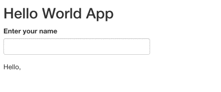


```{r}
ui <- fluidPage(
  titlePanel('Hello World App'),
  textInput('name', 'Enter Name'),
  textOutput('greeing')
)

server <- function(input, output, session) {
  output$greeting <- renderText({
    paste('Hello,', input$greeting)
  })
}

shinyApp(ui, server)
```

Building a shiny app is like assembling lego blocks. There are `input` blocks that let users interact with the app, `output` blocks that respond to the user
inputs, and `reactivity`, the magical glue that makes all of this possible.

In this section, we will first explore these building blocks in isolation, and 
the put them together to build some apps.

## Inputs


Let's learn about the other kinds of inputs available for you to use in your
Shiny apps. Shiny provides a variety of inputs to choose from. For example, you
can use a `sliderInput` to allow users to select a year. A `selectInput` is a
great way to allow for a selection from a list of fixed options, such as a
preference for dogs or cats. The `numericalInput` allows you to provide a range
of numbers users can choose from, which they can increase or decrease using the
little arrows. A `dateRangeInput` allows you to provide users with a set of
dates, and a calendar drop down appears when they click so they can select a
specific one.

I would recommend the 
[shiny cheatsheet](https://shiny.rstudio.com/images/shiny-cheatsheet.pdf) to 
quickly explore different input types.

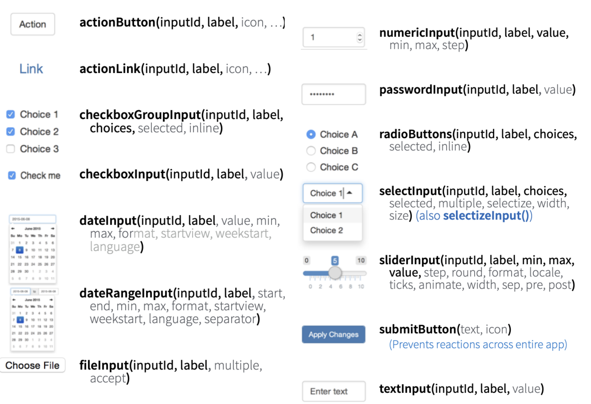


### Text

##### `textInput`

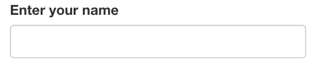

```{r}
ui <- fluidPage(
  # Add a text input to get name
  textInput(
    inputId = 'name',
    label = 'Enter your name'
  )
)

server <- function(input, output, session) {

}

shinyApp(ui, server)
```

#### `selectInput`

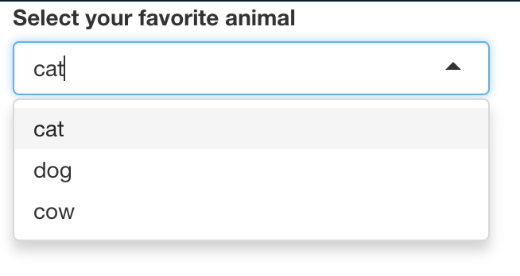

```{r}
ui <- fluidPage(
  # Add a select input to choose an animal from cat, dog, and cow
  selectInput(
    inputId = 'animal', 
    label = 'Select your favorite animal', 
    choices = c('cat', 'dog', 'cow'),
    multiple = TRUE
  )
)

server <- function(input, output, session) {

}
shinyApp(ui, server)
```

You can allow users to select multiple items by setting `multiple = TRUE`


```{r}
ui <- fluidPage(
  # Add a select input to choose multiple animals from cat, dog and cow
  selectInput(
    inputId = 'animal', 
    label = 'Select your favorite animal', 
    choices = c('cat', 'dog', 'cow'),
    multiple = TRUE
  )
)

server <- function(input, output, session) {

}
shinyApp(ui, server)
```


### Numeric

#### `numericInput`


```{r}
ui <- fluidPage(
  titlePanel('Numeric Input'),
  numericInput(
    inputId = 'number',
    label = 'Select Number',
    value = 10,
    min = 0,
    max = 100
  )
)

server <- function(input, output, session) {
  
}
shinyApp(ui, server)
```


#### `sliderInput`


```{r}
ui <- fluidPage(
  # Add a slider input to select a year between 1900 and 2000
  sliderInput(
    inputId = 'year', 
    label = 'Select a year', 
    min = 1900, 
    max = 2000, 
    value = 1925
  )
)
server <- function(input, output, session){
  
}
shinyApp(ui, server)
```

### Date

#### `dateInput`

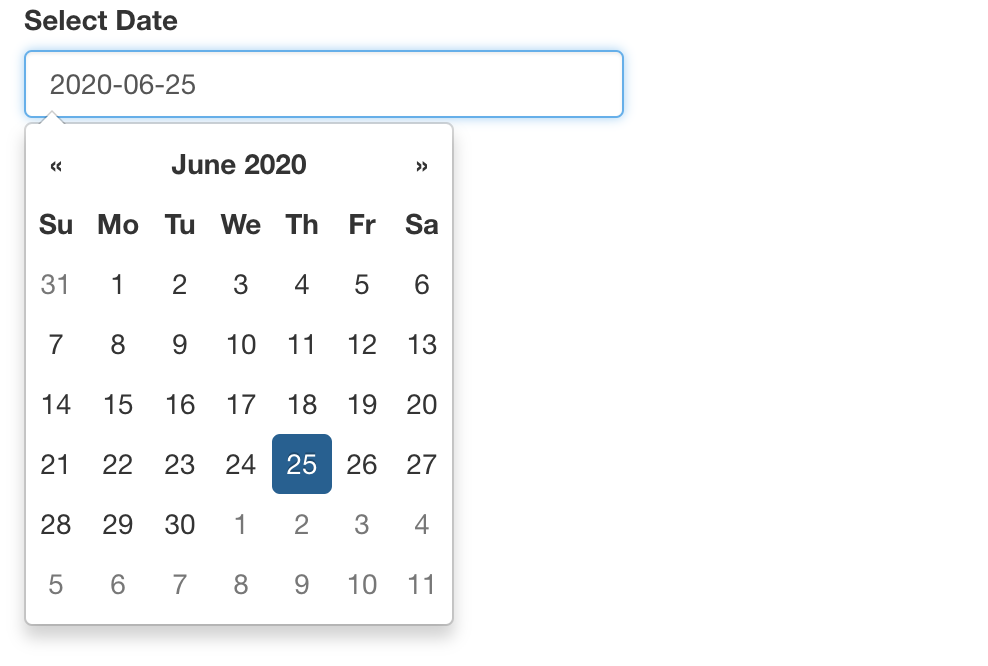

```{r}
ui <- fluidPage(
  # Add a date input to let user select a date between 2000 and 2020
  dateInput(
    inputId = "date",
    label = "Select Date",
    value = "2020-06-25",
    min = "2000-01-01",
    max = "2020-12-31"
  )
)
server <- function(input, output, session) {

}
shinyApp(ui, server)
```

#### `dateRangeInput`

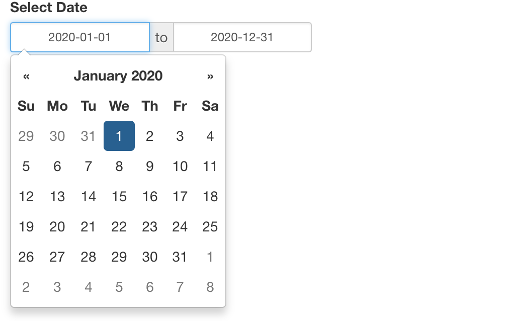

```{r}
ui <- fluidPage(
  dateRangeInput(
    inputId = "date",
    label = "Select Date",
    start = "2020-01-01",
    end = "2020-12-31"
  )
)
server <- function(input, output, session) {

}
shinyApp(ui, server)
```


===============================================================================

## Outputs

We've covered inputs, but without outputs, inputs aren't yet very useful in 
your app. Shiny provides a number of output types out of the box, including, 
text, plot, table, image, and html.

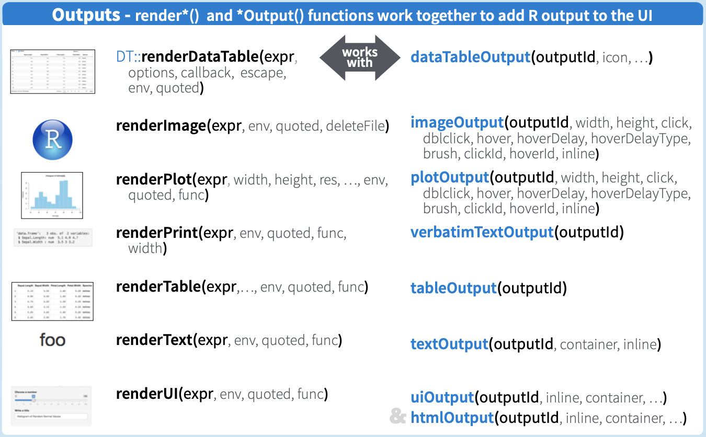


In this section, we will learn how to create outputs, render them, and
display them in the UI. Adding an output to a shiny app involves four steps:

1. [Server] Write code to create the output.
2. [Server] Render the output using a `render___()` function. 
3. [Server] Assign the rendered output to the `output` object.
4. [UI] Display it in the UI using a `___Output()` function.

We will follow these steps systematically to add plot and table outputs. The
logic to add other output types is very similar. We will be using the
`babynames` dataset that tracks the number of children with a specific name,
born every year.

```{r}
library(babynames)
head(babynames)
```

### Table

#### Static

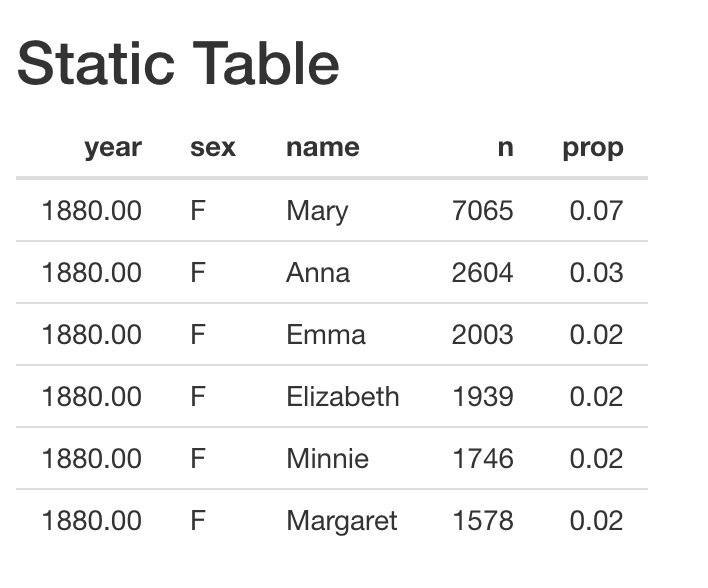


```{r}
ui <- fluidPage(
  titlePanel('Static Table'),
  tableOutput('table')
)

server <- function(input, output, session){
  output$table <- renderTable({
    babynames[1:6,]
  })
}

shinyApp(ui, server)
```

#### Interactive

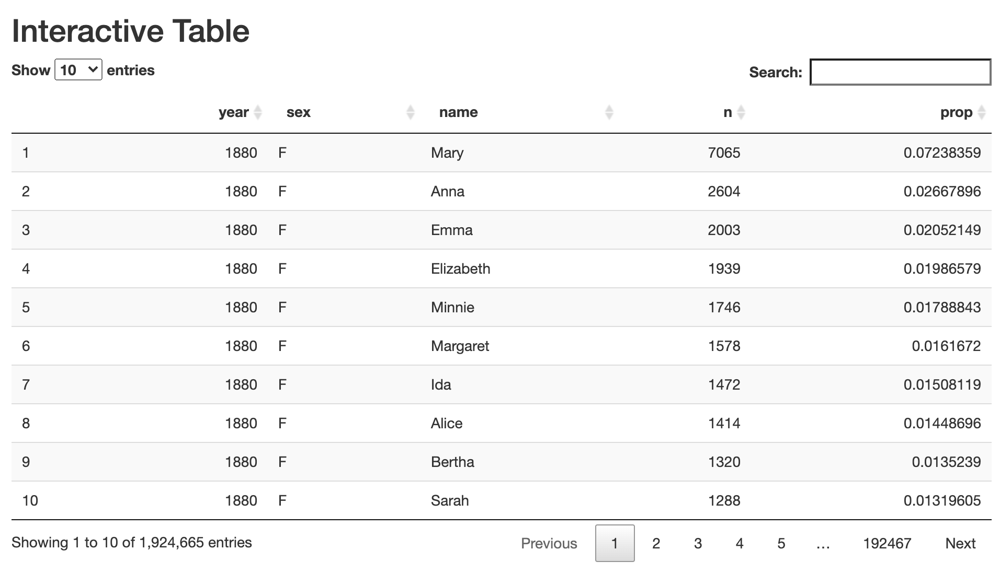

```{r}
ui <- fluidPage(
  titlePanel('Interactive Table'),
  DTOutput('table')
)
server <- function(input, output, session){
  output$table <- renderDT({
    babynames
  })
}
shinyApp(ui, server)
```

### Plots

#### Static

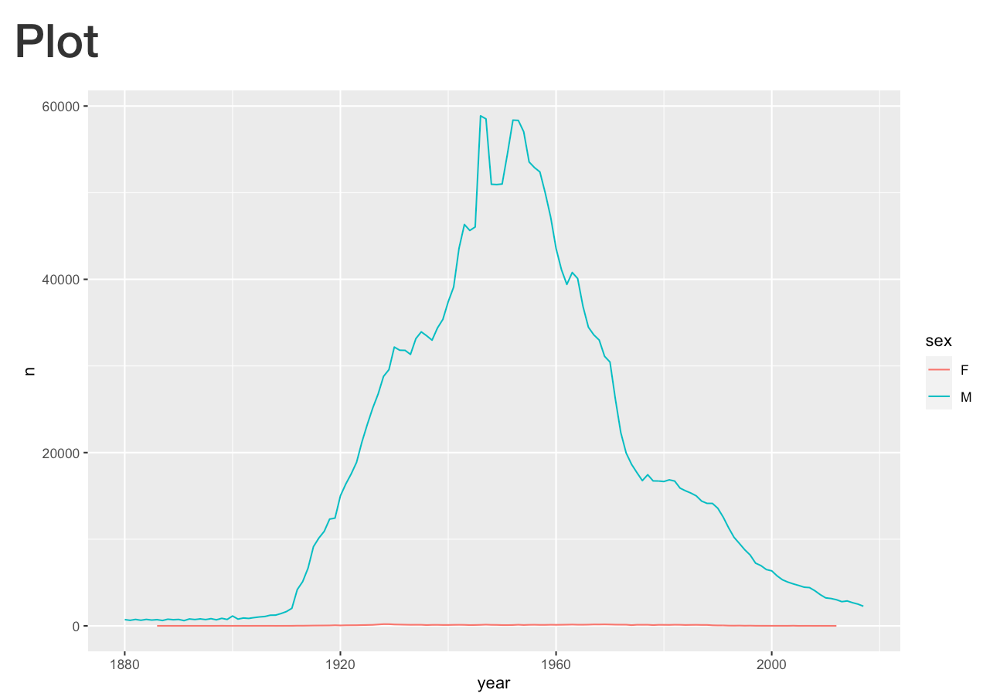

```{r}
ui <- fluidPage(
  titlePanel('Plot'),
  plotOutput('plot')
)
server <- function(input, output, session){
  output$plot <- renderPlot({
    babynames %>% 
      filter(name == "Richard") %>% 
      qplot(x = year, y = n, color = sex, data = ., geom = 'line')
  })
}
shinyApp(ui, server)
```


#### Interactive

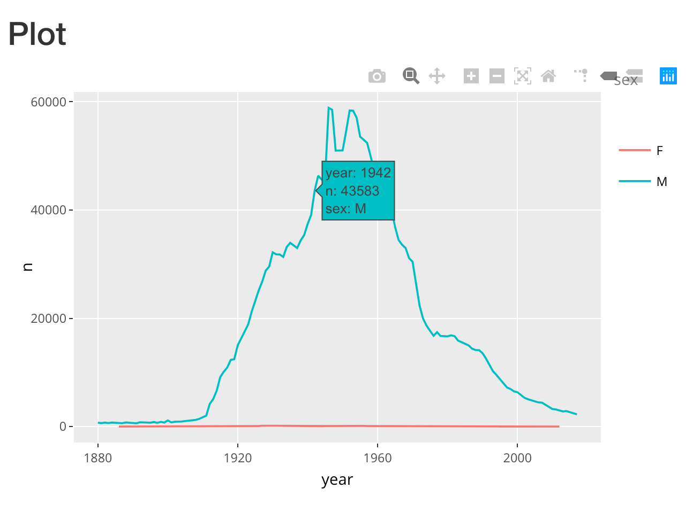

```{r}
ui <- fluidPage(
  titlePanel('Plot'),
  plotlyOutput('plot')
)
server <- function(input, output, session){
  output$plot <- renderPlotly({
    babynames %>% 
      filter(name == "Richard") %>% 
      qplot(x = year, y = n, color = sex, data = ., geom = 'line')
  })
}
shinyApp(ui, server)
```

### HTMLWidgets

[HTMLWidgets](http://gallery.htmlwidgets.org/) extend the range of outputs 
available to build shiny apps. For example, the `dygraphs` package provides
functionality to display interactive, zoomable plots of time-series data.


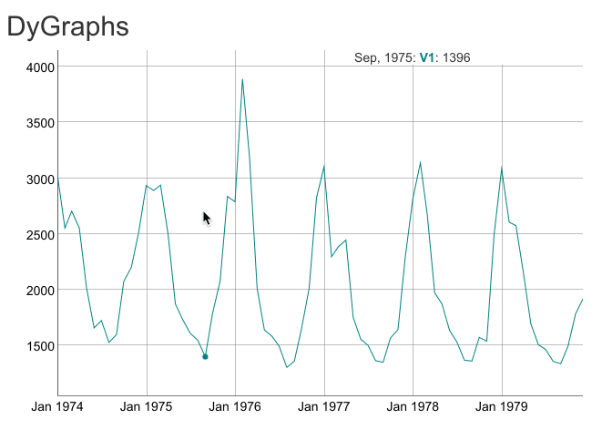

```{r}
ui <- fluidPage(
  titlePanel('DyGraphs'),
  dygraphs::dygraphOutput('dy_plot')
)
server <- function(input, output, session) {
  output$dy_plot <- dygraphs::renderDygraph({
    dygraphs::dygraph(ldeaths)
  })
}
shinyApp(ui, server)
```


💡Tips

1. Pair your `render___()` and `___Output()` functions correctly.
2. Ensure that `output$object` is displayed using `___Output('object')`.


===============================================================================

## Reactivity

So far we have learned about inputs and outputs. A web app typically customizes
the output in response to user input. In this section, we will learn about
reactivity, the magic behind everything in shiny!

### Reactivity 101

Let us revisit the app we just created. Currently it is set up to display a
trend plot of the name "Richard". It would be great if we could have the output
plot **react** to a name entered by the user.

If we add a `textInput()` with `inputId = "name"`, then we will be able to
access the value entered by the user as `input$name`. This is the simplest form
of reactivity, where an `output` **reacts** automatically to the change in value
of an `input`.

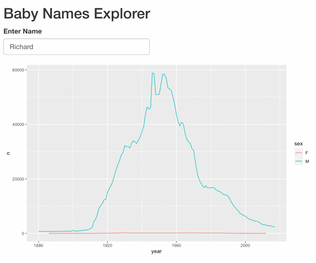

We have already copied code for the app you created in the section on static 
plots (Outputs > Plots > Static). Modify the code to:

1. Add a `textInput()` to let the user enter a name.
2. Update the plotting code to filter for the name entered by the user.

```{r}
ui <- fluidPage(
  titlePanel('Plot'),
  textInput('name', 'Enter Name'),
  plotOutput('plot')
)
server <- function(input, output, session){
  output$plot <- renderPlot({
    user_name <- input$name
    babynames %>% 
      filter(name == user_name) %>% 
      ggplot(aes(x = year, y = n, color = sex)) +
      geom_line()
  })
}
shinyApp(ui, server)
```


### Keeping it DRY!

Great work! Let us now augment the app we just created by adding an interactive
table of the data being plotted. We will use the `renderDT()` and `DTOutput`
functions provided by the `DT` package.


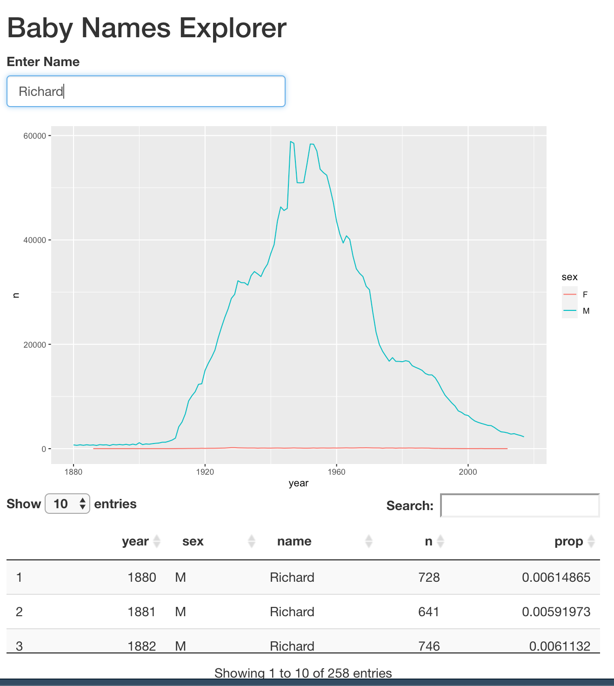

Copy code for the app you just created, and add an interactive table with the
same data as the plot. As a reminder, you can add an interactive table output
by:

1.  Writing code to create the output.
2.  Render the output as a table using `renderDT({})`
3.  Assign the rendered output to `output$table`
4.  Display the output in the UI using `DTOutput()`.

```{r}
ui <- fluidPage(
  titlePanel("Baby Names Explorer"),
  textInput('name', 'Enter Name'),
  plotOutput('plot'),
  DT::DTOutput('table')
)

server <- function(input, output, session) {
  output$plot <- renderPlot({
    user_name <- input$name
    babynames %>% 
      filter(name == user_name) %>% 
      ggplot(aes(x = year, y = n, color = sex)) +
      geom_line()
  })
  output$table <- DT::renderDT({
    user_name <- input$name
    babynames %>% 
      filter(name == user_name)
  })
}

shinyApp(ui, server)
```

🎉 Awesome! You are beginning to now get the hang of reactivity and how to build
a shiny app!

### Reactive Expressions

In the app we just created, note how we are filtering the `babynames` dataset
twice, once to create the plot, and once again to create the table. If this were
a computationally expensive operation, then it would slow down the
responsiveness of our app. How do we ensure that we keep computations DRY?

The answer to this question is to use reactive values and expressions. Let us
start with reactive expressions. It is easy to create a reactive expression
`rval`, by simply wrapping your computation inside the function `reactive()`,
and access its value by calling `rval()`.

```r
rval <- reactive({
  # COMPUTATIONS
})
```

Let us refactor the app we just created, by moving the filtering of data into
a reactive expression. Copy the code for the app you just created and make two
modifications.

1. Create a reactive expression named `rval_names` to compute the filtered data.
2. Access the filtered data in the outputs as `rval_names()`.


```{r}
ui <- fluidPage(
  titlePanel("Baby Names Explorer"),
  textInput('name', 'Enter Name'),
  plotOutput('plot'),
  DT::DTOutput('table')
)

server <- function(input, output, session) {
  rval_names <- reactive({
    user_name <- input$name
    babynames %>% 
      filter(name == user_name)
  })
  output$plot <- renderPlot({
    rval_names() %>% 
      ggplot(aes(x = year, y = n, color = sex)) +
      geom_line()
  })
  output$table <- DT::renderDT({
    rval_names()
  })
}

shinyApp(ui, server)
```

Reactive expressions allow encapsulation of repeated computations leading to
better performance. A reactive expression can depend on inputs as well as other
reactive expressions, and updates its value in response to its dependencies.
There are two significant advantages of using reactive expressions:

1.  They are executed lazily. For example, if we have a shiny app with different
    tabs, then only those reactive expressions that are called by an output on
    the visible tab get executed.
   
2.  They are cached. Hence, expensive computations only get executed once,
    providing a significant

As an aside, did you notice how an empty plot and table appear at the outset
when we have not yet entered a name. This happens because `input$name` is NULL
at the outset, and hence both the plot and table outputs receive an empty data
frame.

One way to prevent empty outputs from appearing is to use the `req()` function
and pass it the set of inputs for which we don't want to display any output
unless it has a non-null value. How about we try it out?

### Delaying Actions

So far you have seen how reactivity automatically triggers changes in outputs
based on changes to inputs. Sometimes, it is desirable to delay actions.

For example, we might want to click on an update button in order to update the
outputs. This can be accomplished using `eventReactive(input$x, {expr})`, which
delays the execution of the expression computed in `expr` until the input `x` is
updated.

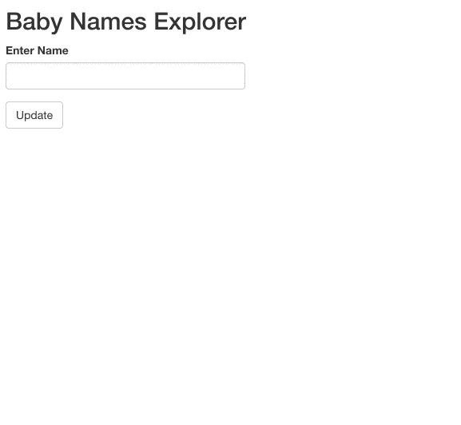


We have already copied the code for the app you just created in the previous 
section. Modify this app to:

1.  Add an `actionButton()` just below the `textInput`.
2.  Use `eventReactive()` so `rval_names` only updates when the button is
    clicked.


```{r}
ui <- fluidPage(
  titlePanel("Baby Names Explorer"),
  textInput('name', 'Enter Name'),
  actionButton('update', 'Update'),
  plotOutput('plot'),
  DT::DTOutput('table')
)

server <- function(input, output, session) {
  rval_names <- eventReactive(input$update, {
    babynames %>% 
      filter(name == !!input$name)
  })
  output$plot <- renderPlot({
     rval_names() %>% 
      ggplot(aes(x = year, y = n, color = sex)) +
      geom_line()
  })
  output$table <- DT::renderDT({
    rval_names()
  })
}

shinyApp(ui, server)
```

### Triggering Actions

At times, we might want to manually trigger an action in response to an event.
This should be very familiar to those of you who have used javascript frameworks
like `jQuery`.

This can be accomplished using `observeEvent(input$x, {callback})`, where the
code in `callback` is executed in response to an update to the input `x`. Let us
now use this function to display a modal dialog with information about the app,
when a button is clicked.

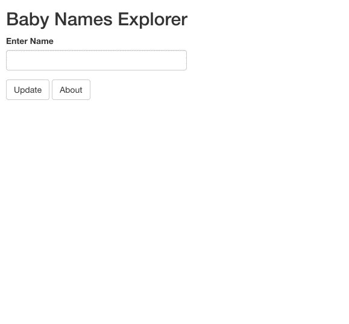

Copy the code for the app we just created and make two modifications:

1. Add an `actionButton()` alongside the existing button.
2. Use `observeEvent` to display a modal dialog with information about the app.

Note that you can display the text "About" in a modal dialog by calling
`showModal(modalDialog("About"))`


```{r}
ui <- fluidPage(
  titlePanel("Baby Names Explorer"),
  textInput('name', 'Enter Name'),
  actionButton('update_output', 'Update'),
  actionButton('show_about', 'About'),
  plotOutput('plot'),
  DT::DTOutput('table')
)

server <- function(input, output, session) {
  rval_names <- eventReactive(input$update_output, {
    babynames %>% 
      filter(name == !!input$name)
  })
  output$plot <- renderPlot({
     rval_names() %>% 
      ggplot(aes(x = year, y = n, color = sex)) +
      geom_line()
  })
  output$table <- DT::renderDT({
    rval_names()
  })
  observeEvent(input$show_about, {
    showModal(modalDialog("This app was built by Ramnath"))
  })
}

shinyApp(ui, server)
```


===============================================================================

## Layouts

The final piece in the puzzle before we can start building our dashboard is 
layouts. These are functions that allow inputs and outputs to be visually
arranged (or "laid" out) in the UI. A well chosen layout makes a Shiny app
aesthetically more appealing, easier to navigate, and more user-friendly.

### `sidebarLayout`

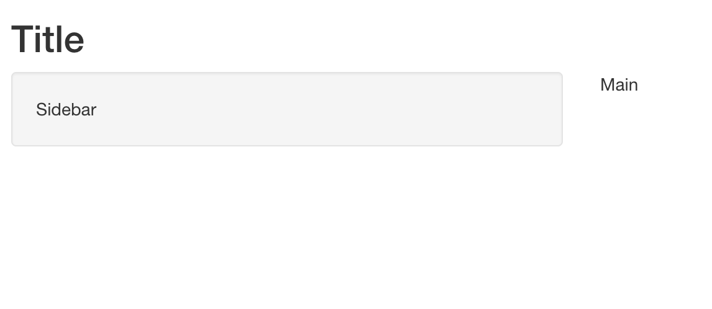

```{r}
ui <- fluidPage(
  titlePanel("Title"),
  sidebarLayout(
    sidebarPanel('Sidebar'),
    mainPanel('Main')
  )
)
```

Let us modify the baby names explorer app we created in the **Reactive
Expressions** section so that the input is in a side panel and the two outputs
are in the main panel. We have already copied the code for the app you created.
Modify it to:

1. Wrap inputs and outputs in a `sidebarLayout()`.
2. Move input to a side panel by wrapping inside `sidebarPanel()`
3. Move outputs to a main panel by wrapping inside `mainPanel()`

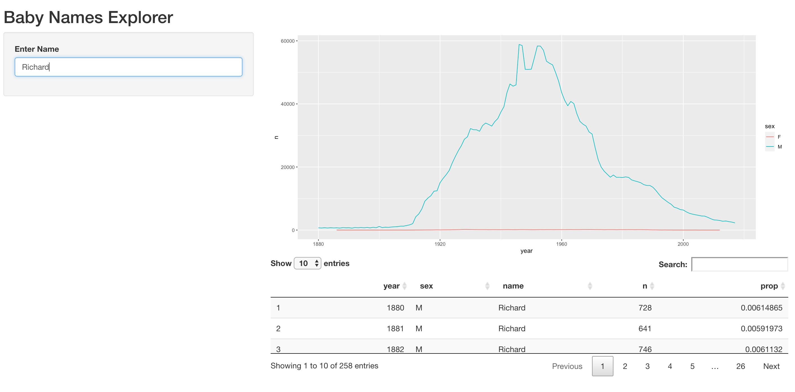

```{r}
ui <- fluidPage(
  titlePanel("Baby Names Explorer"),
  sidebarLayout(
    sidebarPanel(
      textInput('name', 'Enter Name')
    ),
    mainPanel(
      plotOutput('plot'),
      DT::DTOutput('table')
    )
  )
)
server <- function(input, output, session) {
  rval_names <- reactive({
    user_name <- input$name
    req(user_name)
    babynames %>% 
      filter(name == user_name)
  })
  output$plot <- renderPlot({
    rval_names() %>% 
      ggplot(aes(x = year, y = n, color = sex)) +
      geom_line()
  })
  output$table <- DT::renderDT({
    rval_names()
  })
}
shinyApp(ui, server)
```

### `tabsetPanel`

Another useful layout uses a combination of `tabsetPanel()` and `tabPanel()` to
arrange multiple outputs as tabs.

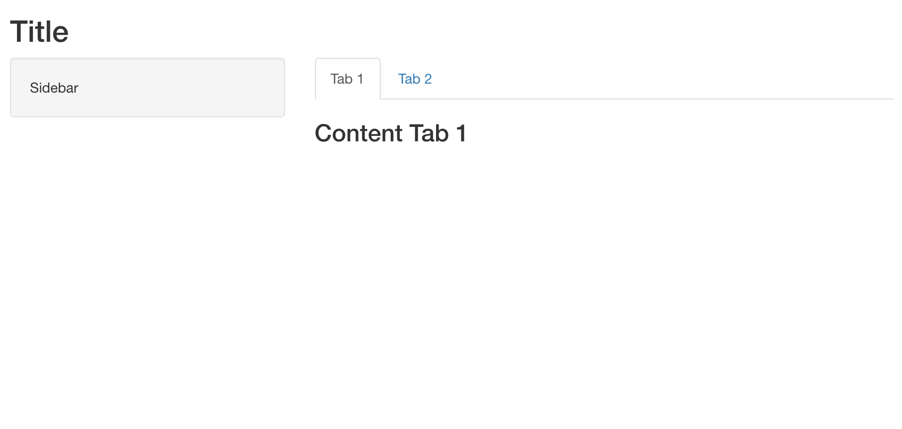


```{r}
ui <- fluidPage(
  titlePanel('Title'),
  sidebarLayout(
    sidebarPanel('Sidebar'),
    mainPanel(
      tabsetPanel(
        tabPanel("Tab 1", h3("Content Tab 1")),
        tabPanel("Tab 2", h3("Content Tab 2"))
      )
    )
  )
)
```

Let us use these layout functions to display the plot and table in different
tabs.

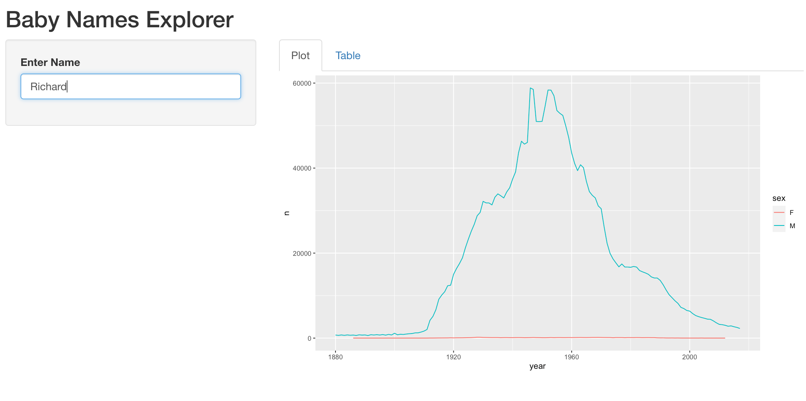

Copy the code for the app you just created and modify it to display the plot
and table in different tabs by using `tabsetPanel` and `tabPanel`, just like in
the example code above.

1. Wrap both outputs in a `tabsetPanel()`.
2. Wrap each output in a `tabPanel()`.

```{r}
ui <- fluidPage(
  titlePanel("Baby Names Explorer"),
  sidebarLayout(
    sidebarPanel(
      textInput('name', 'Enter Name')
    ),
    mainPanel(
      tabsetPanel(
        tabPanel('Plot', plotOutput('plot')),
        tabPanel('Table', DT::DTOutput('table'))
      )
    )
  )
)
server <- function(input, output, session) {
  rval_names <- reactive({
    user_name <- input$name
    req(user_name)
    babynames %>% 
      filter(name == user_name)
  })
  output$plot <- renderPlot({
    rval_names() %>% 
      ggplot(aes(x = year, y = n, color = sex)) +
      geom_line()
  })
  output$table <- DT::renderDT({
    rval_names()
  })
}
shinyApp(ui, server)
```

### Themes

In addition to layouts, the `shinythemes` package allows you to make use of 
pre-built themes that allow you to change the color scheme and typography of 
your app. You can use the `themeSelector()` function to experiment with 
different themes, and then set `theme = shinythemes::shinytheme(theme = '___')`
to choose a desired theme.

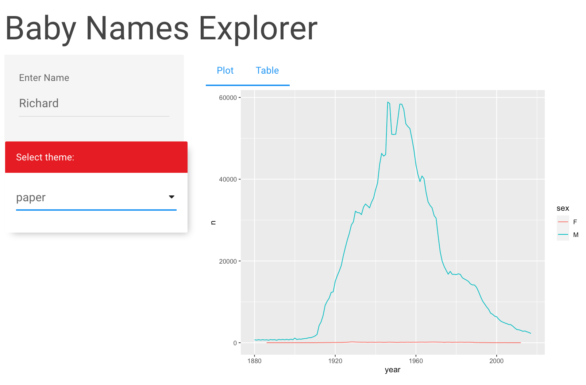

Copy over the code for the app you just created and experiment with
different themes by adding `shinythemes::themeSelector()` to the UI. Once you
settle on a theme you like, add the `theme` to the UI.

```{r}
ui <- fluidPage(
  titlePanel("Baby Names Explorer"),
  shinythemes::themeSelector(),
  sidebarLayout(
    sidebarPanel(
      textInput('name', 'Enter Name')
    ),
    mainPanel(
      tabsetPanel(
        tabPanel('Plot', plotOutput('plot')),
        tabPanel('Table', DT::DTOutput('table'))
      )
    )
  )
)
server <- function(input, output, session) {
  rval_names <- reactive({
    user_name <- input$name
    req(user_name)
    babynames %>% 
      filter(name == user_name)
  })
  output$plot <- renderPlot({
    rval_names() %>% 
      ggplot(aes(x = year, y = n, color = sex)) +
      geom_line()
  })
  output$table <- DT::renderDT({
    rval_names()
  })
}
shinyApp(ui, server)
```


===============================================================================

## Build MoMa App

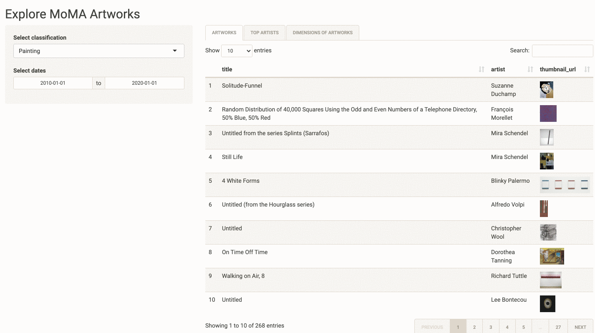

### Explore Dataset

```{r}
artworks <- readr::read_csv('../data/Artworks.csv.gz') %>% 
  janitor::clean_names()
artworks
```

### Prototype Outputs

#### Artworks Acquired by Date Range and Classification

```{r}
artworks_subset <- artworks %>% 
 filter(!is.na(artist)) %>% 
 filter(date_acquired >= '2010-01-01') %>% 
 filter(date_acquired <= '2020-01-01') %>% 
 filter(classification == 'Painting')

artworks_subset
```

#### Top 10 Artists by Classification

```{r}
artworks_subset %>% 
  count(artist, sort = TRUE) %>%
  mutate(artist = forcats::fct_reorder(artist, n)) %>% 
  head(10) %>% 
  ggplot(aes(x = n, y = artist)) +
  geom_col() +
  labs(
    title = 'Top 10 Artists',
    subtitle = 'Painting',
    x = 'Number of Artworks',
    y = 'Artist'
  )
```

#### Distribution of Heights and Widths by Classification

```{r}
artworks_subset %>% 
  ggplot(aes(x = width_cm, y = height_cm)) +
  geom_point(alpha = 0.5) +
  labs(
    title = "Distribution of Width and Heights",
    subtitle = 'Painting',
    x = 'Width',
    y = 'Height'
  )
```
#### Distribution of Heights and Widths by Classification: Rectangle Plot

```{r}
artworks_subset %>% 
  ggplot(aes(xmin = 0, ymin = 0, xmax = width_cm, ymax = height_cm)) +
  geom_rect(alpha = 0.5) +
  labs(
    title = 'Distribution of Width vs. Height',
    subtitle = 'Painting',
    x = 'Width',
    y = 'Height'
  )
```

### Build App

```{r}
ui <- fluidPage(
  titlePanel("Explore MoMA Artworks"),
  # Set theme to "sandstone"
  theme = shinythemes::shinytheme("sandstone"),
  sidebarLayout(
    sidebarPanel(
      # Add select input to select classification
      selectInput(
        inputId = 'group', 
        label = 'Select classification', 
        choices = unique(artworks$classification), 
        selected = 'Painting'
      ),
      # Add date range input to select date range
      dateRangeInput(
        inputId = 'date_range', 
        label = 'Select dates', 
        start = '2010-01-01', 
        end = '2020-01-01'
      )
    ),
    mainPanel(
      tabsetPanel(
        # Add tabPanel with an interactive table of filtered artworks
        tabPanel("Artworks", p(), 
          DTOutput('dt_artworks', height = 600)
        ),
        # Add tabPanel with a plot of top 10 artists
        tabPanel("Top Artists", p(), 
          plotOutput('plot_top_artists', height = 600)
        ),
        # Add tabPanel with a plot of width vs. height
        tabPanel("Dimensions of Artworks", p(), 
          plotlyOutput('plotly_artwork_dimensions', height = 600)
        )
      )
    )
  )
  
)
server <- function(input, output, session) {
  # Add a reactive expression to filter artworks
  rval_artworks <- reactive({
    group <- input$group
    date_range <- input$date_range
    artworks %>% 
     filter(!is.na(artist)) %>% 
     filter(date_acquired >= date_range[1]) %>% 
     filter(date_acquired <= date_range[2]) %>% 
     filter(classification == group)
  })
  
  # Render an interactive table of filtered artworks
  output$dt_artworks <- renderDT({
    rval_artworks() %>% 
      filter(thumbnail_url != "") %>% 
      select(title, artist, thumbnail_url) %>% 
      mutate(thumbnail_url = sprintf("", thumbnail_url)) %>% 
      DT::datatable(escape = FALSE, style = 'bootstrap')
  })
  
  
  # Render a plot of top 10 artists
  output$plot_top_artists <- renderPlot({
    rval_artworks() %>% 
      count(artist, sort = TRUE) %>%
      mutate(artist = forcats::fct_reorder(artist, n)) %>% 
      head(10) %>% 
      ggplot(aes(x = n, y = artist)) +
      geom_col() +
      labs(
        title = 'Top 10 Artists',
        subtitle = 'Painting',
        x = 'Number of Artworks',
        y = 'Artist'
      )
  })
  
  
  # Render an interactive plot of width vs. height
  output$plotly_artwork_dimensions <- renderPlotly({
    rval_artworks() %>% 
      ggplot(aes(x = width_cm, y = height_cm, tooltip = title)) +
      geom_point(alpha = 0.5) +
      labs(
        title = "Distribution of Width and Heights",
        subtitle = 'Painting',
        x = 'Width',
        y = 'Height'
      )
  })
  
  
  
}
shinyApp(ui, server)
```


