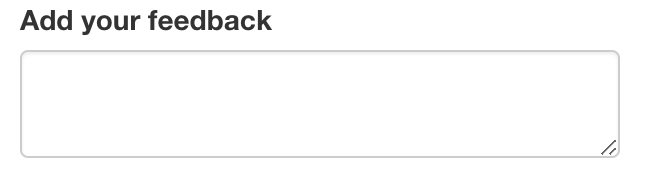

```{r setup, include = FALSE}
# Load shiny
library(shiny)
# Load tidyverse
library(tidyverse)
# Set option to launch shiny app in viewer
if (requireNamespace('rstudioapi', quietly = TRUE)){
  options(shiny.launch.browser = rstudioapi::viewer)
}
```

## Shiny 101

```{r}
ui <- fluidPage(
  # 1. Add a text input to get user name
  textInput('name', label = 'Enter your name'),
  # 3. Display text output with greeting
  textOutput('greeting')
)
server <- function(input, output, session){
  # 2. Render a text greeting
  output$greeting <- renderText({
    paste("Hello,", input$name)
  })
}
shinyApp(ui, server)
```


## Text

### `textInput`


```{r}
ui <- fluidPage(
  # Add a text input to get name
  textInput(
    inputId = 'name',
    label = 'Enter your name'
  )
)

server <- function(input, output, session) {

}

shinyApp(ui, server)
```

### `textAreaInput`



```{r}
ui <- fluidPage(
  # Add a text area input to get user feedback
  textAreaInput(
    inputId = 'feedback', 
    label = 'Add your feedback'
  )
)

server <- function(input, output, session) {

}

shinyApp(ui, server)
```

### `selectInput`


```{r}
ui <- fluidPage(
  # Add a select input to choose a favorite animal
  selectInput(
    inputId = 'animal', 
    label = 'Select your favorite animal', 
    choices = c('cat', 'dog', 'cow')
  )
)

server <- function(input, output, session) {

}

shinyApp(ui, server)
```


```{r}
ui <- fluidPage(
  # Add a select input to choose multiple favorite animals
  selectInput(
    inputId = 'animal', 
    label = 'Select your favorite animal', 
    choices = c('cat', 'dog', 'cow'),
    multiple = TRUE
  )
)

server <- function(input, output, session) {

}

shinyApp(ui, server)
```

### `checkboxInput`
### `checkboxGroupInput`
### `varSelectInput`


## Numeric

### `numericInput`
### `sliderInput`


```{r}
ui <- fluidPage(
  # Add a slider input
  sliderInput(
    inputId = 'year', 
    label = 'Select a year', 
    min = 1900, 
    max = 2000, 
    value = 1925
  )
)

server <- function(input, output, session){
  
}

shinyApp(ui, server)
```

## Date

### `dateInput`
### `dateRangeInput`

## Boolean

### `radioButtons`
### `checkboxInput`

## Additional Inputs

```{r}
shinyWidgets::shinyWidgetsGallery()
```


## Reactivity


