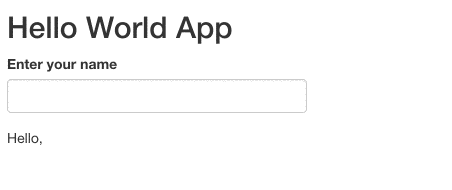
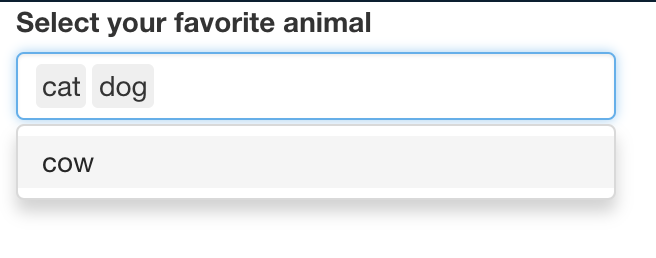
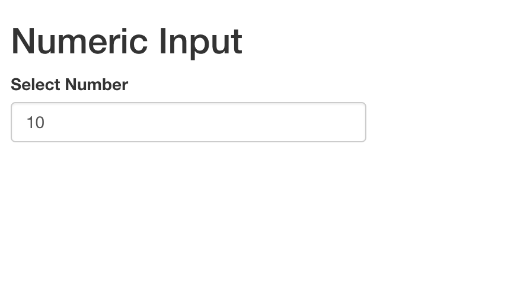
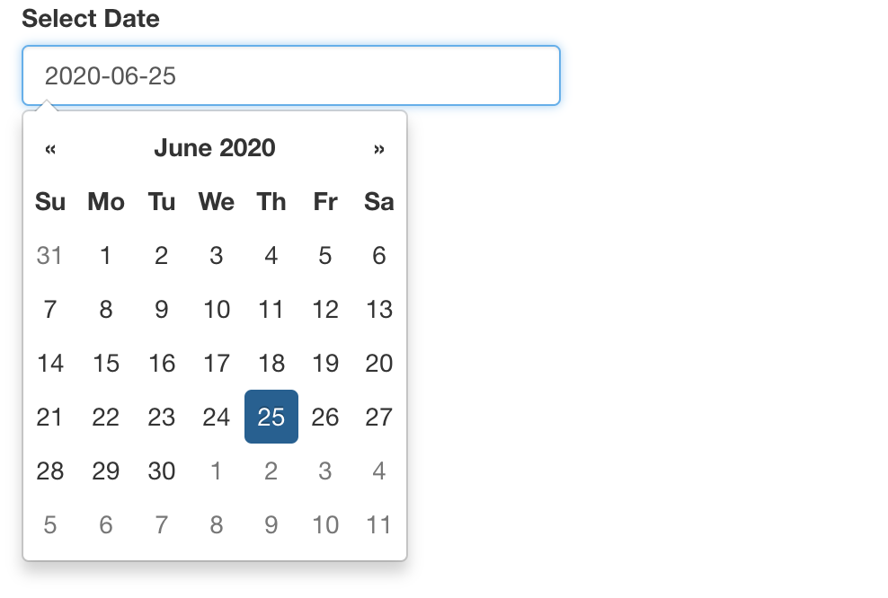
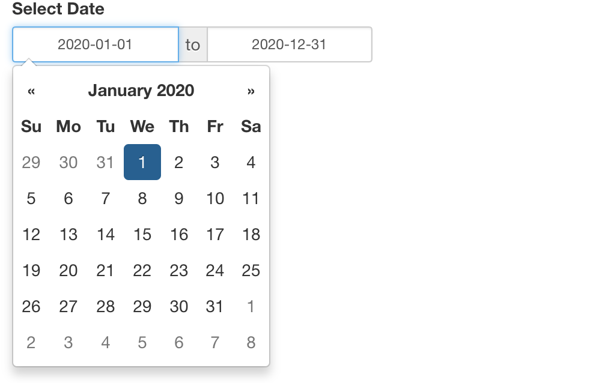

```{r setup, include = FALSE}
# Load shiny
library(shiny)
# Load tidyverse
library(tidyverse)
# Set option to launch shiny app in viewer
if (requireNamespace('rstudioapi', quietly = TRUE)){
  options(shiny.launch.browser = rstudioapi::viewer)
}
```

## Shiny 101



```{r}
ui <- fluidPage(
  titlePanel('Hello World App'),
  # 1. Add a text input to get user name
  textInput('name', label = 'Enter your name'),
  # 2. Display text output with greeting
  textOutput('greeting')
)
server <- function(input, output, session){
  # 3. Render a text greeting
  output$greeting <- renderText({
    paste("Hello,", input$name)
  })
}
shinyApp(ui, server)
```

## Inputs

Let's learn about the other kinds of inputs available for you to use in your
Shiny apps. Shiny provides a variety of inputs to choose from. For example, you
can use a `sliderInput` to allow users to select a year. A `selectInput` is a
great way to allow for a selection from a list of fixed options, such as a
preference for dogs or cats. The `numericalInput` allows you to provide a range
of numbers users can choose from, which they can increase or decrease using the
little arrows. A `dateRangeInput` allows you to provide users with a set of
dates, and a calendar drop down appears when they click so they can select a
specific one.

## Text

### `textInput`


```{r}
ui <- fluidPage(
  # Add a text input to get name
  textInput(
    inputId = 'name',
    label = 'Enter your name'
  )
)

server <- function(input, output, session) {

}

shinyApp(ui, server)
```


All input functions have their first argument, an `inputId`, in common. The
`inputId` needs to be a character string, and each input should have a unique id
so you can refer to it in the server to make updates to the app.

Many inputs have a `label` as their next argument, which is a character string
that is often shown to the user to let them know what they should do with the
input.

From there, each input function has unique arguments that help you successfully
build the app. A `selectInput` requires a list of choices. The user will
automatically see the first choice in the list. A `sliderInput` requires value
that the slider will be set at by default, then a `min` and `max` of the other
values users can choose from.

### `textAreaInput`


```{r}
ui <- fluidPage(
  # Add a text area input to get user feedback
  textAreaInput(
    inputId = 'feedback', 
    label = 'Add your feedback'
  )
)

server <- function(input, output, session) {

}

shinyApp(ui, server)
```

### `selectInput`


```{r}
ui <- fluidPage(
  # Add a select input to choose a favorite animal
  selectInput(
    inputId = 'animal', 
    label = 'Select your favorite animal', 
    choices = c('cat', 'dog', 'cow')
  )
)

server <- function(input, output, session) {

}

shinyApp(ui, server)
```




```{r}
ui <- fluidPage(
  # Add a select input to choose multiple favorite animals
  selectInput(
    inputId = 'animal', 
    label = 'Select your favorite animal', 
    choices = c('cat', 'dog', 'cow'),
    multiple = TRUE
  )
)

server <- function(input, output, session) {

}

shinyApp(ui, server)
```

### `varSelectInput`


```{r}
library(shiny)

ui <- fluidPage(
  titlePanel('Selecting columns from a table'),
  varSelectInput(
    inputId = 'cols',
    label = 'Select Columns',
    data = mtcars,
    multiple = TRUE
  )
)

server <- function(input, output, session) {
  
}

shinyApp(ui, server)
```

### `checkboxGroupInput`


```{r}
library(shiny)

ui <- fluidPage(
  titlePanel('Check Box Group'),
  checkboxGroupInput(
    inputId = 'variables',
    label = 'Select variables to display',
    choices = c('cyl', 'am', 'gear')
  )
)

server <- function(input, output, session) {
  
}

shinyApp(ui, server)
```

## Numeric

### `numericInput`



```{r}
library(shiny)

ui <- fluidPage(
  titlePanel('Numeric Input'),
  numericInput(
    inputId = 'number',
    label = 'Select Number',
    value = 10,
    min = 0,
    max = 100
  )
)

server <- function(input, output, session) {
  
}

shinyApp(ui, server)
```

### `sliderInput`


```{r}
ui <- fluidPage(
  # Add a slider input
  sliderInput(
    inputId = 'year', 
    label = 'Select a year', 
    min = 1900, 
    max = 2000, 
    value = 1925
  )
)

server <- function(input, output, session){
  
}

shinyApp(ui, server)
```

## Date

### `dateInput`



```{r}
library(shiny)

ui <- fluidPage(
  dateInput(
    inputId = "date",
    label = "Select Date",
    value = "2020-06-25"
  )
)

server <- function(input, output, session) {

}

shinyApp(ui, server)
```

### `dateRangeInput`



```{r}
library(shiny)

ui <- fluidPage(
  dateRangeInput(
    inputId = "date",
    label = "Select Date",
    start = "2020-01-01",
    end = "2020-12-31"
  )
)

server <- function(input, output, session) {

}

shinyApp(ui, server)
```

## Boolean

### `radioButtons`


```{r}
library(shiny)

ui <- fluidPage(
  radioButtons(
    inputId = 'distribution',
    label = 'Select Distribution',
    choices = c(norm = 'Normal', unif = 'Uniform', poisson = 'Poisson')
  )
)

server <- function(input, output, session) {
  
}

shinyApp(ui, server)
```


### `checkboxInput`


```{r}
library(shiny)

ui <- fluidPage(
  checkboxInput(
    inputId = 'show_plot',
    label = 'Show Plot'
  )
)

server <- function(input, output, session) {
  
}

shinyApp(ui, server)
```

## Additional Inputs

```{r}
shinyWidgets::shinyWidgetsGallery()
```


## Reactivity


