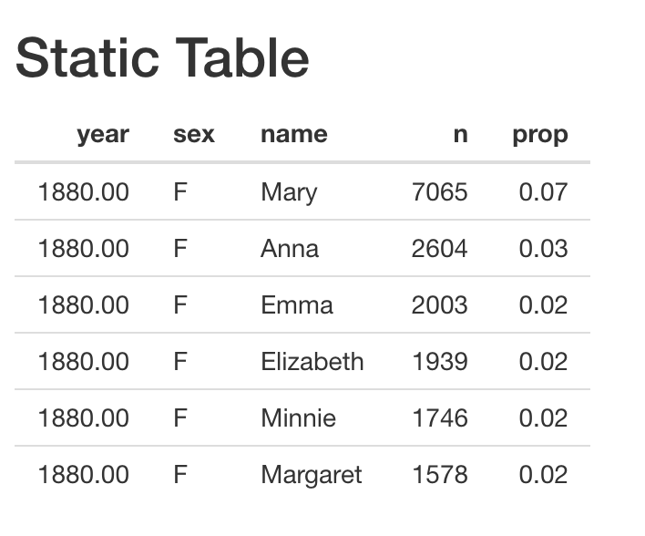
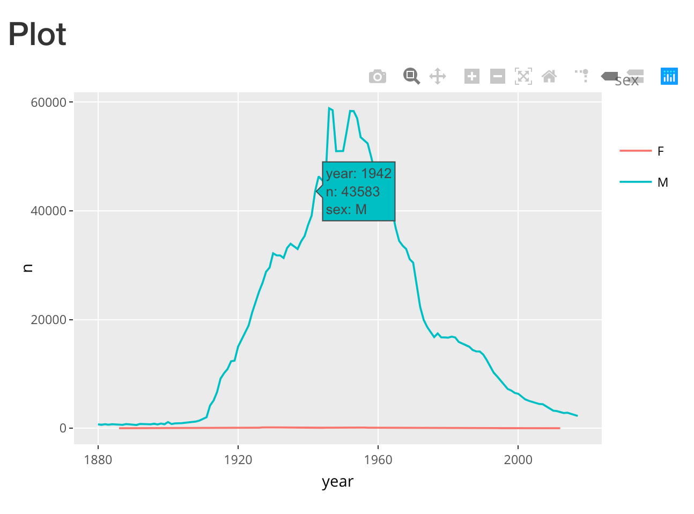

```{r setup, include = FALSE}
# Load shiny
library(shiny)
# Load tidyverse
library(tidyverse)
# Set option to launch shiny app in viewer
if (requireNamespace('rstudioapi', quietly = TRUE)){
  options(shiny.launch.browser = rstudioapi::viewer)
}
```

We've covered inputs, but without outputs, inputs aren't yet very useful in 
your app. Let's learn more about outputs and render functions so you can build 
a full app.


## Text


```{r}
ui <- fluidPage(
  titlePanel("Text Output"),
  # 2. Display output in UI
  textOutput('text')
)
server <- function(input, output, session){
  # 1. Render output in server
  output$text <- renderText({
    'Hello, World!'
  })
}
shinyApp(ui, server)
```

## Table

### Static




```{r}
ui <- fluidPage(
  titlePanel('Static Table'),
  # Display table in UI
  tableOutput('table')
)

server <- function(input, output, session){
  # Render table in server
  output$table <- renderTable({
    mtcars[1:6, 1:6]
  })
}

shinyApp(ui, server)
```

### Interactive


```{r}
ui <- fluidPage(
  titlePanel('Interactive Table'),
  # Display interactive table
  dataTableOutput('table')
)
server <- function(input, output, session){
  # Render interactive table
  output$table <- renderDataTable({
    mtcars[1:6, 1:6]
  })
}
shinyApp(ui, server)
```


## Plots

### Static


```{r}
ui <- fluidPage(
  titlePanel('Plot'),
  # Display plot
  plotOutput('plot')
)
server <- function(input, output, session){
  # Render plot
  output$plot <- renderPlot({
    ggplot(mtcars, aes(x = wt, y = mpg)) +
      geom_point()
  })
}
shinyApp(ui, server)
```


### Interactive



```{r}
library(plotly)
ui <- fluidPage(
  titlePanel('Plot'),
  # Display interactive plot
  plotlyOutput('plot')
)
server <- function(input, output, session){
  # Render interactive plot
  output$plot <- renderPlotly({
    ggplot(mtcars, aes(x = wt, y = mpg)) +
      geom_point()
  })
}
shinyApp(ui, server)
```

## Generic


```{r}
library(shiny)

ui <- fluidPage(
  uiOutput('ui')
)

server <- function(input, output, session) {
  output$ui <- renderUI({
    tags$div(
      tags$h2('UI Output'),
      tags$img(
        src = "https://c.tadst.com/gfx/750w/sunrise-sunset-sun-calculator.jpg?1",
        width = '100%'
      ),
      tags$p(class = 'lead', "This is a beautiful sunrise!")
    )
  })
}

shinyApp(ui, server)
```


## HTMLWidgets

[HTMLWidgets Gallery](http://gallery.htmlwidgets.org/)

### DyGraphs

```{r}
library(shiny)

ui <- fluidPage(
  titlePanel('DyGraphs'),
  dygraphs::dygraphOutput('dy_plot')
)

server <- function(input, output, session) {
  output$dy_plot <- dygraphs::renderDygraph({
    dygraphs::dygraph(ldeaths)
  })
}

shinyApp(ui, server)
```

