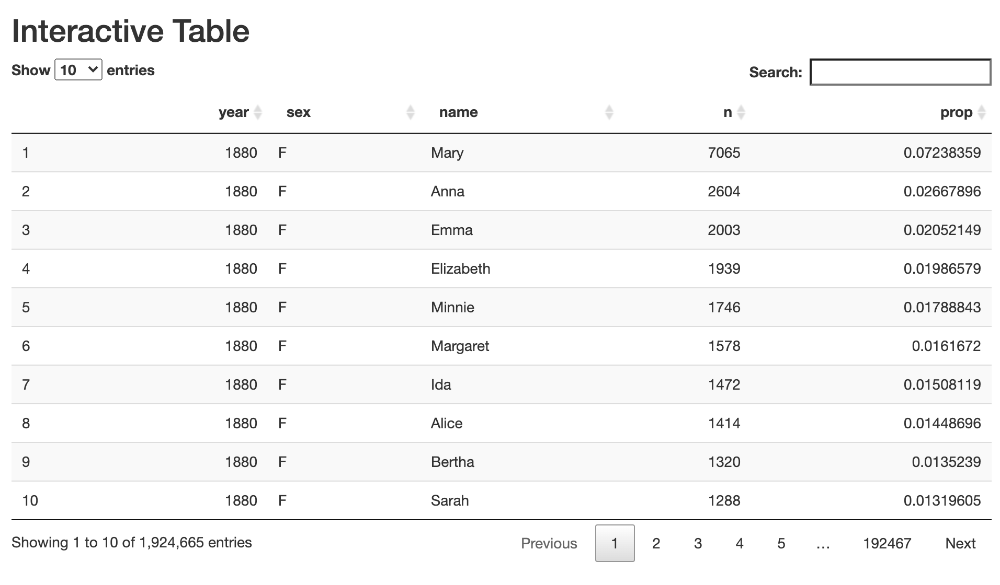
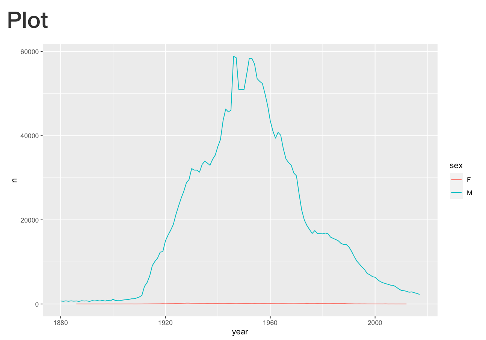

```{r setup, include = FALSE}
# Load shiny
library(shiny)
# Load tidyverse
library(tidyverse)
# Define empty server functi
server <- function(input, output, session) {

}
if (requireNamespace('rstudioapi', quietly = TRUE)){
  options(shiny.launch.browser = rstudioapi::viewer)
}
```


## Text

```{r}
ui <- fluidPage(
  textOutput('text')
)
server <- function(input, output, session){
  output$text <- renderText({
    'Hello, World!'
  })
}
shinyApp(ui, server)
```

## `tableOutput`


```{r}
ui <- fluidPage(
  titlePanel('Table'),
  # Display table
  tableOutput('table')
)
server <- function(input, output, session){
  # Render table
  output$table <- renderTable({
    mtcars[1:6, 1:6]
  })
}
shinyApp(ui, server)
```

## `DTOutput`



```{r}
ui <- fluidPage(
  titlePanel('Table'),
  # Display interactive table
  DT::DTOutput('table')
)
server <- function(input, output, session){
  # Render interactive table
  output$table <- DT::renderDT({
    mtcars[1:6, 1:6]
  })
}
shinyApp(ui, server)
```


## `plotOutput`



```{r}
ui <- fluidPage(
  titlePanel('Plot'),
  # Display plot
  plotOutput('plot')
)
server <- function(input, output, session){
  # Render plot
  output$plot <- renderPlot({
    ggplot(mtcars, aes(x = wt, y = mpg)) +
      geom_point()
  })
}
shinyApp(ui, server)
```


## `plotlyOutput`


```{r}
library(plotly)
ui <- fluidPage(
  titlePanel('Plot'),
  # Display interactive plot
  plotlyOutput('plot')
)
server <- function(input, output, session){
  # Render interactive plot
  output$plot <- renderPlotly({
    ggplot(mtcars, aes(x = wt, y = mpg)) +
      geom_point()
  })
}
shinyApp(ui, server)
```

## HTMLWidgets

http://gallery.htmlwidgets.org/
