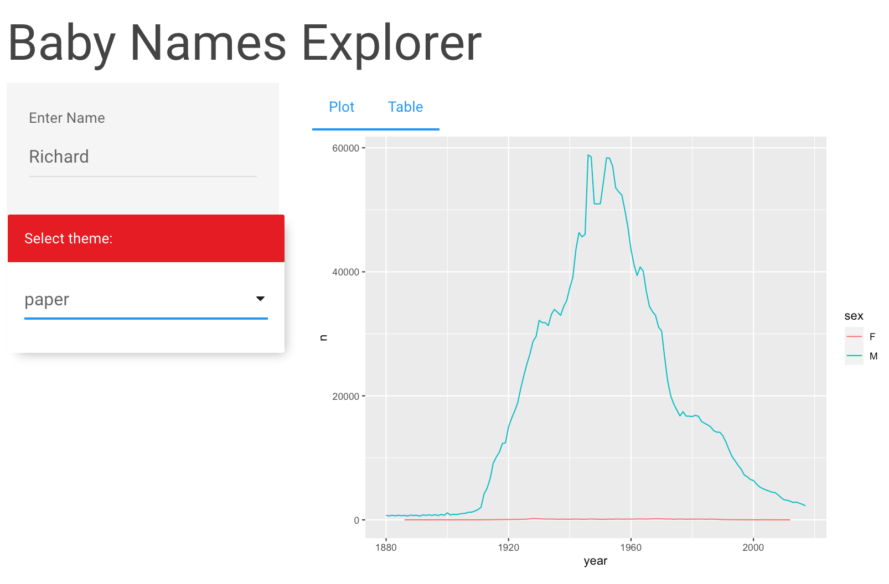

```{r setup, include = FALSE}
# Load shiny
library(shiny)
# Load tidyverse
library(tidyverse)
# Define empty server functi
server <- function(input, output, session) {

}
if (requireNamespace('rstudioapi', quietly = TRUE)){
  options(shiny.launch.browser = rstudioapi::viewer)
}
```

## Layouts

Let's learn about layout functions that allow inputs and outputs to be visually
arranged (or "laid" out) in the UI. A well chosen layout makes a Shiny app
aesthetically more appealing, easier to navigate, and more user-friendly.

### `sidebarLayout`


```{r}
ui <- fluidPage(
  titlePanel("Title"),
  sidebarLayout(
    sidebarPanel('Sidebar'),
    mainPanel('Main')
  )
)
shinyApp(ui, server)
```

### `tabsetPanel`


```{r}
ui <- fluidPage(
  titlePanel('Title'),
  sidebarLayout(
    sidebarPanel('Sidebar'),
    mainPanel(
      tabsetPanel(
        tabPanel("Tab 1"),
        tabPanel("Tab 2")
      )
    )
  )
)
shinyApp(ui, server)
```

### `navbarPage`


```{r}
ui <- navbarPage(
  "App Title",
  tabPanel("Page 1"),
  tabPanel("Page 2"),
  tabPanel("Page 3")
)
shinyApp(ui, server)
```

## Themes

In addition to layouts, the `shinythemes` package allows you to make use of 
pre-built themes that allow you to change the color scheme and typography of 
your app. You can use the `themeSelector()` function to experiment with 
different themes, and then set `theme = shinythemes::shinytheme(theme = '___')`
to choose a desired theme.



```{r}
ui <- fluidPage(
  titlePanel('Title'),
  # Add `themeSelector` from `shinythemes` package
  shinythemes::themeSelector(),
  sidebarLayout(
    sidebarPanel('Sidebar'),
    mainPanel(
      tabsetPanel(
        tabPanel("Tab 1"),
        tabPanel("Tab 2")
      )
    )
  )
)
shinyApp(ui, server)
```

