```{r setup, include = FALSE}
# Load shiny
library(shiny)
# Load tidyverse
library(tidyverse)
# Set option to launch shiny app in viewer
if (requireNamespace('rstudioapi', quietly = TRUE)){
  options(shiny.launch.browser = rstudioapi::viewer)
}
```

## Inputs


Let's learn about the other kinds of inputs available for you to use in your
Shiny apps. Shiny provides a variety of inputs to choose from. For example, you
can use a `sliderInput` to allow users to select a year. A `selectInput` is a
great way to allow for a selection from a list of fixed options, such as a
preference for dogs or cats. The `numericalInput` allows you to provide a range
of numbers users can choose from, which they can increase or decrease using the
little arrows. A `dateRangeInput` allows you to provide users with a set of
dates, and a calendar drop down appears when they click so they can select a
specific one.

### Text

##### `textInput`

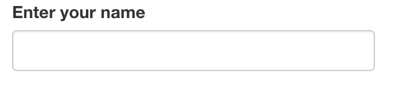

```{r}
ui <- fluidPage(
  # Add a text input to get name
  
)
server <- function(input, output, session) {

}
shinyApp(ui, server)
```

#### `selectInput`

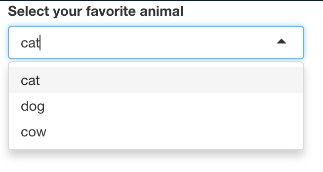

```{r}
ui <- fluidPage(
  # Add a select input to choose an animal from cat, dog, and cow

)
server <- function(input, output, session) {

}
shinyApp(ui, server)
```

You can allow users to select multiple items by setting `multiple = TRUE`

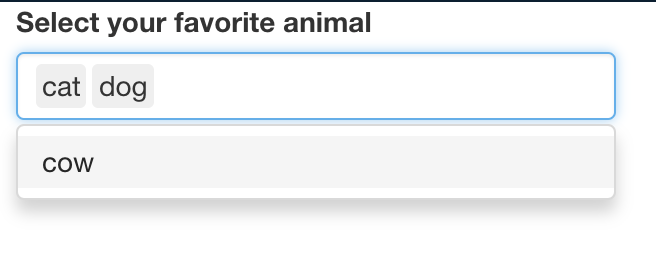
```{r}
ui <- fluidPage(
  # Add a select input to choose multiple animals from cat, dog and cow

)
server <- function(input, output, session) {

}
shinyApp(ui, server)
```


### Numeric

#### `numericInput`

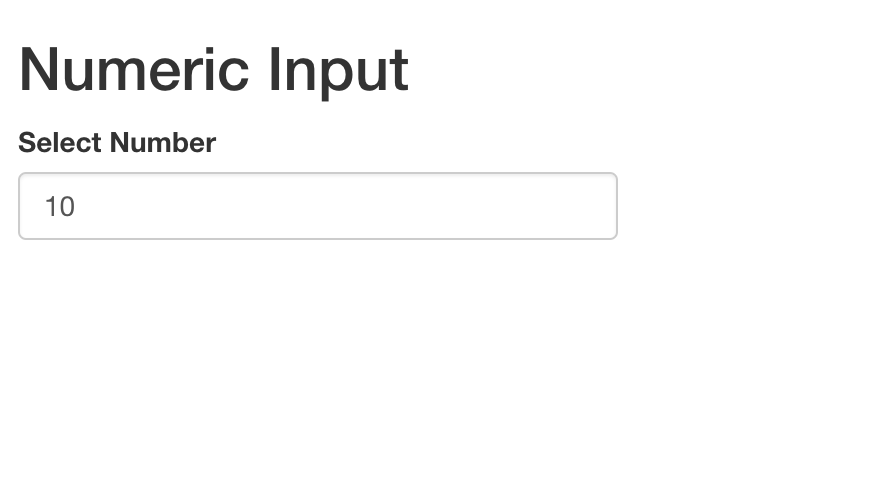

```{r}
ui <- fluidPage(
  # Add a numeric input to let user pick a number from 0 to 10
  
  
)

server <- function(input, output, session) {
  
}
shinyApp(ui, server)
```


#### `sliderInput`


```{r}
ui <- fluidPage(
  # Add a slider input to select a year between 1900 and 2000
  
)
server <- function(input, output, session){
  
}
shinyApp(ui, server)
```

### Date

#### `dateInput`

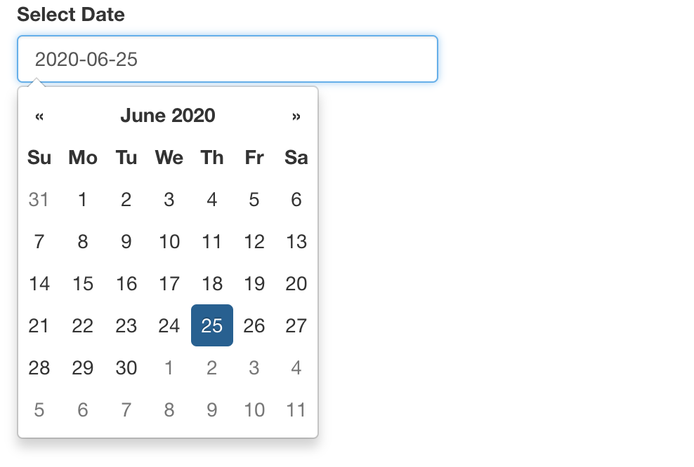

```{r}
ui <- fluidPage(
  # Add a date input to let user select a date between 2000 and 2020
  
)
server <- function(input, output, session) {

}
shinyApp(ui, server)
```

#### `dateRangeInput`

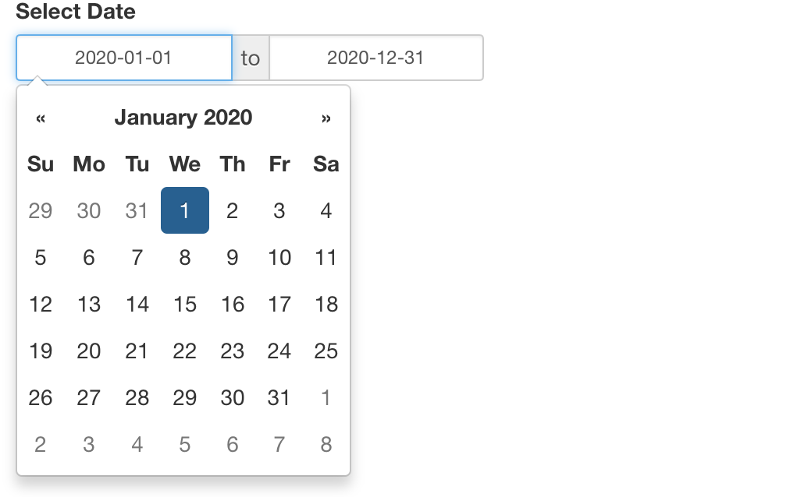

```{r}
ui <- fluidPage(
  # Add a date range input to let user select two dates between 2000 and 2020
  dateRangeInput(
    inputId = "date",
    label = "Select Date",
    start = "2020-01-01",
    end = "2020-12-31"
  )
)
server <- function(input, output, session) {

}
shinyApp(ui, server)
```

## Outputs

We've covered inputs, but without outputs, inputs aren't yet very useful in 
your app. Let's learn more about outputs and render functions so you can build 
a full app. Adding an output to a shiny app involves four steps:

1. [Server] Write code to create the output.
2. [Server] Render the output using a `render___()` function. 
3. [Server] Assign the rendered output to the `output` object.
4. [UI] Display it in the UI using a `___Output()` function.

### Table

#### Static

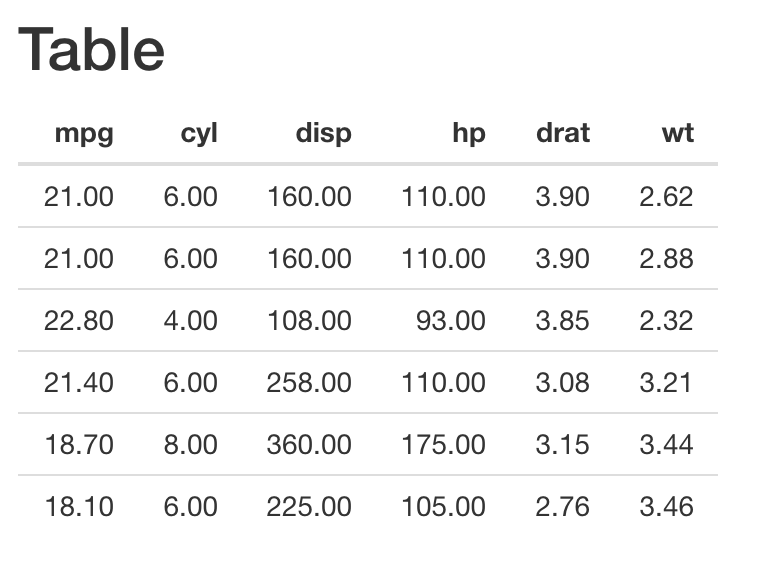

```{r}
ui <- fluidPage(
  titlePanel('Static Table')
  # 4. Display table using `tableOutput()`
  
)

server <- function(input, output, session){
  # 2. Render table using `renderTable()` and 
  # 3. Assign it to `output$table`
  
    # 1. Write code to display first six rows and six columns of mtcars dataset
 
}

shinyApp(ui, server)
```

#### Interactive

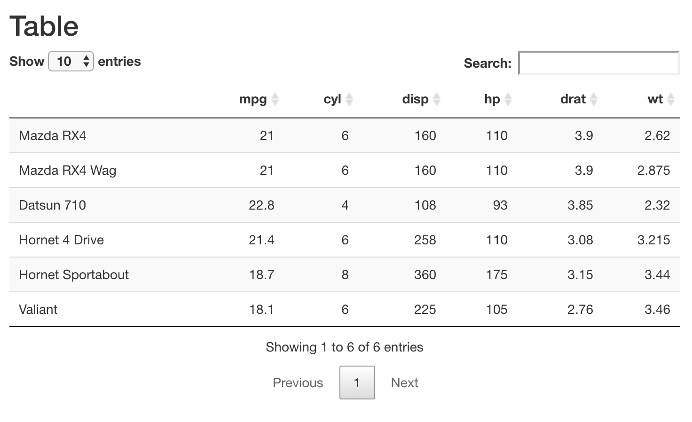

```{r}
ui <- fluidPage(
  titlePanel('Interactive Table')
  # 4. Display interactive table using `dataTableOutput()`

)
server <- function(input, output, session){
  # 2. Render interactive table using `renderDataTable()` and 
  # 3. Assign it to `output$table`

    # 1. Write code to display first six rows and six columns of mtcars dataset


}
shinyApp(ui, server)
```


### Plots

#### Static

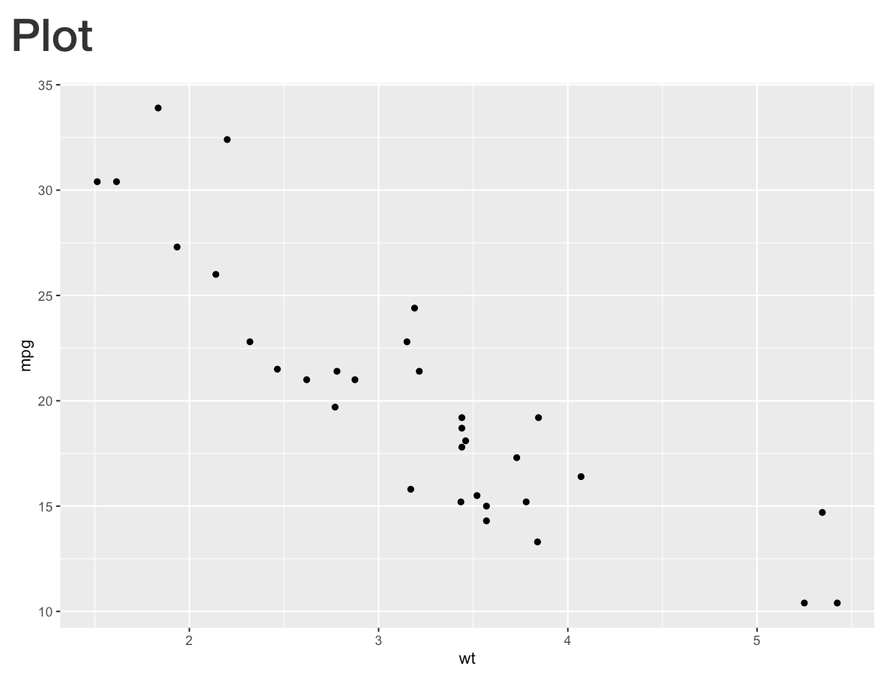

```{r}
ui <- fluidPage(
  titlePanel('Plot')
  # 4. Display plot using `plotOutput()`
  
)
server <- function(input, output, session){
  # 2. Render plot using `renderPlot()` and 
  # 3. Assign it to `output$plot`

    # 1. Write code to create a scatterplot of mpg vs. wt in mtcars dataset.


}
shinyApp(ui, server)
```


#### Interactive

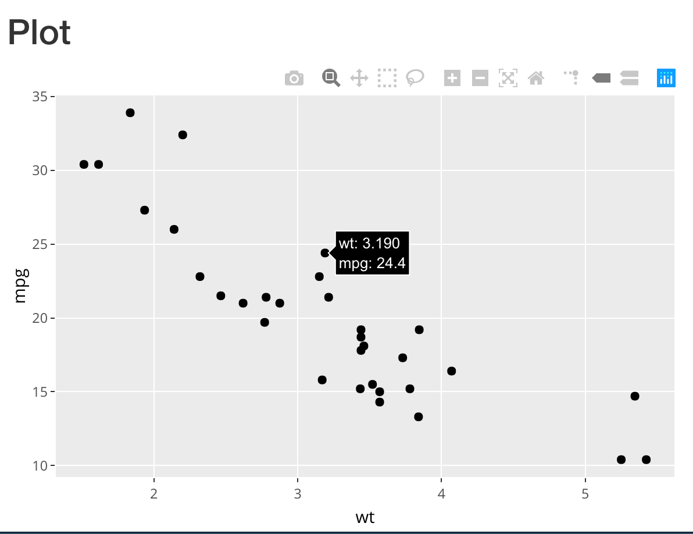

Copy over the code from the app you previously created and make the plot 
interactive by using `plotlyOutput` and `renderPlotly()`

```{r}
library(plotly)

```


### Others

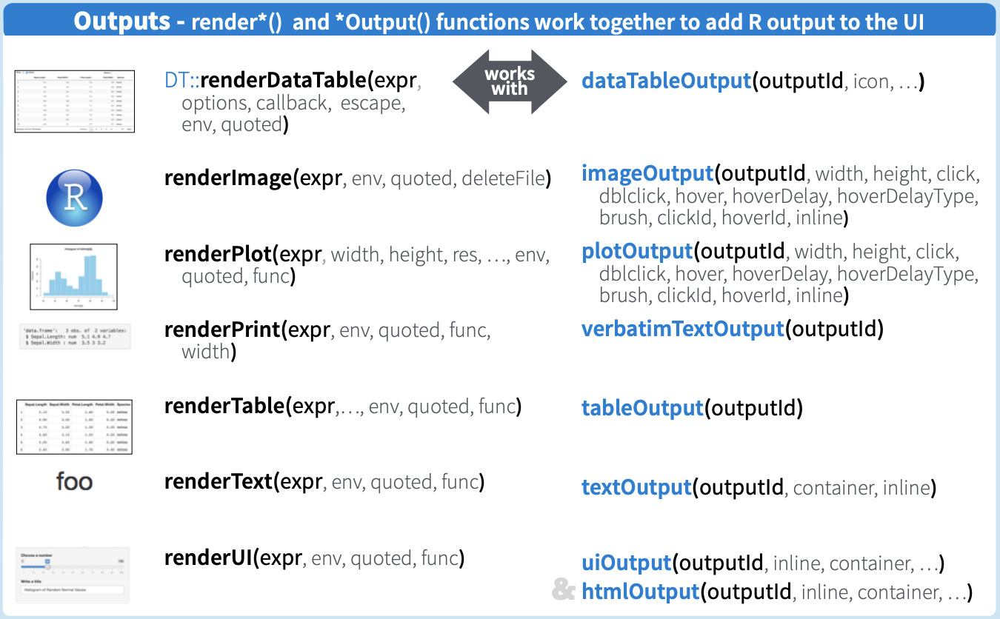


### HTMLWidgets

[HTMLWidgets](http://gallery.htmlwidgets.org/) extend the range of outputs 
available to build shiny apps. For example, the `dygraphs` package provides
functionality to display interactive, zoomable plots of time-series data.


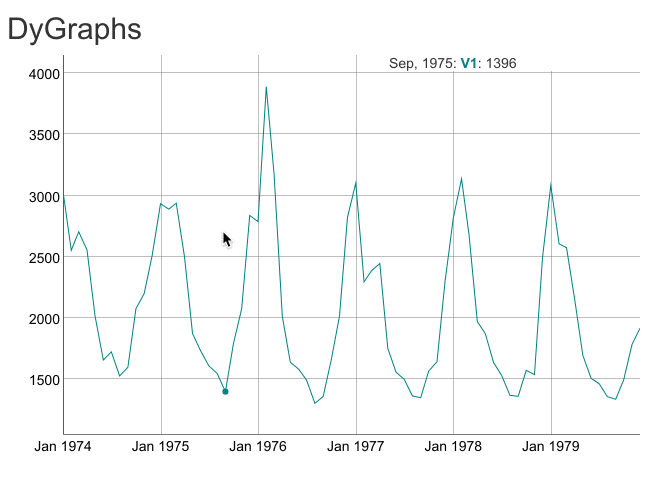

```{r}
ui <- fluidPage(
  titlePanel('DyGraphs'),
  dygraphs::dygraphOutput('dy_plot')
)
server <- function(input, output, session) {
  output$dy_plot <- dygraphs::renderDygraph({
    dygraphs::dygraph(ldeaths)
  })
}
shinyApp(ui, server)
```


💡Tips

1. Pair your `render___()` and `___Output()` functions correctly.
2. Ensure that `output$object` is displayed using `___Output('object')`.

## Reactivity

So far we have learned about inputs and outputs. A web app typically customizes
the output in response to user input. In this section, we will learn about
reactivity, the magic behind everything in shiny!

### Reactivity 101

Let us revisit the hello-world app. Currently it is set up to display
"Hello, World" no matter what name the user displays. In order to make
the output react to the input, we need to replace "World" with `input$name`.
This is the simplest form of reactivity, where an `output` __reacts__ 
automatically to the change in value of an `input`.

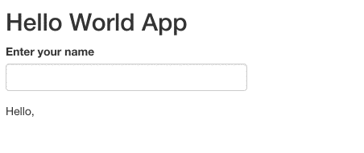


```{r}
ui <- fluidPage(
  titlePanel('Hello World App'),
  textInput('name', label = 'Enter your name'),
  textOutput('greeting')
)
server <- function(input, output, session){
  output$greeting <- renderText({
    # Modify this line to display the name of the user in place of World.
    paste("Hello,", "World")
  })
}
shinyApp(ui, server)
```


### One Input -> One Output

```{r}
library(babynames)
head(babynames)
```

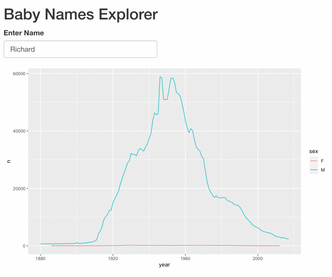

```{r}
ui <- fluidPage(
  # Display a title panel with the name of the app
  titlePanel("Baby Names Explorer")
  # Display a text input to get user name

  # Display a plot output of the trends

)
server <- function(input, output, session) {
  # Render a plot showing trend in name across years and
  # Assign it to an output
 
    # Write code to create a line plot of year vs. n colored by sex


}
shinyApp(ui, server)
```

### One Input -> Two Outputs

Let us augment the app we just created by adding an interactive table
of the data being plotted. We will make use of the `DT` package that 
provides a `renderDT()` function to render interactive tables and a
`DTOutput` function to display them.

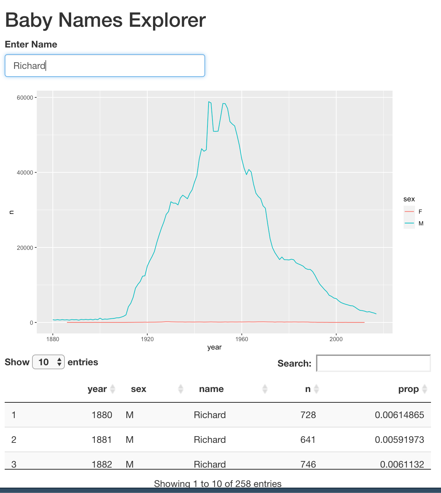

Copy code for the app we just created, and add an interactive table with the
same data as the plot.

```{r}


```

🎉 Awesome! You are beginning to now get the hang of reactivity and how to build
a shiny app!

### Reactive Expressions

In the app we just created, note how we are filtering the `babynames`  dataset
twice, once to create the plot, and once again to create the table. If this 
were a computationally expensive operation, then it would slow down the 
responsiveness of our app. How do we ensure that we keep computations DRY?

The answer to this question is to use reactive values and expressions. Let us start with reactive expressions. It is easy to create a reactive expression `rval`, by simply wrapping your computation inside the function `reactive()`, 
and access its value by calling `rval()`.

Copy the code for the app we just created and create a reactive expression 
named `rval_names` to hold the filtered data.

```{r}


```

Note how an empty plot and table appears at the outset when we have not yet entered a name. This happens because `input$name` is NULL at the outset, and
hence both the plot and table outputs receive an empty data frame. One way
to prevent empty outputs from appearing is to use the `req()`  function and
pass it the set of inputs for which we don't want to display any output unless
it has a non-null value. How about we try it out?

Reactive expressions allow encapsulation of repeated computations leading 
to better performance. A reactive expression can depend on inputs as well
as other reactive expressions, and updates its value in response to its
dependencies. There are two significant advantages of using reactive
expressions:

1. They are executed lazily. For example, if we have a shiny app with 
   different tabs, then only those reactive expressions that are called by
   an output on the visible tab get executed.
2. They are cached. Hence, expensive computations only get executed once,
   providing a significant 
   
### Delaying Actions

So far you have seen how reactivity can automatically trigger changes in
outputs based on changes to inputs. Sometimes, it is desirable to delay
actions. For example, we might want to click on an update button in order
to update the outputs. 

This can be accomplished using `eventReactive(input$x, {expr})`, which delays 
the execution of the expression computed in `expr` until the input `x` is 
updated.

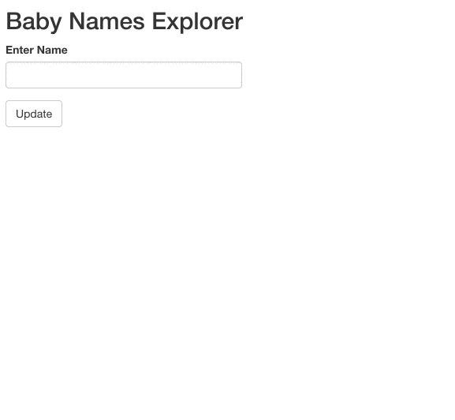

⚽ Copy the code for the app we just created and make two modifications to it:

1. Add an `actionButton()` just below the `textInput`.
2. Use `eventReactive()` so `rval_names` only updates when the button is clicked.


```{r}


```

### Triggering Actions

At times, we might want to manually trigger an action in response to an
event. This should be very familiar to those of you who have used javascript frameworks like `jQuery`. 

This can be accomplished using `observeEvent(input$x, {callback})`, where the
code in `callback` is executed in response to an update to the input `x`. Let
us now use this function to display a modal dialog with information about the 
app, when a button is clicked.

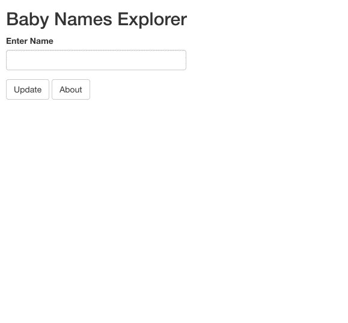

Copy the code for the app we just created and make two modifications:

1. Add an `actionButton()` alongside the existing button.
2. Use `observeEvent` to display a modal dialog with information about the app.

Note that you can display the text "About" in a modal dialog by calling
`showModal(modalDialog("About"))`


```{r}


```

## Layouts

The final piece in the puzzle before we can start building our dashboard is layouts. These are functions that allow inputs and outputs to be visually
arranged (or "laid" out) in the UI. A well chosen layout makes a Shiny app
aesthetically more appealing, easier to navigate, and more user-friendly.

### `sidebarLayout`


```{r}
ui <- fluidPage(
  titlePanel("Title"),
  sidebarLayout(
    sidebarPanel('Sidebar'),
    mainPanel('Main')
  )
)
```

Let us modify the baby names explorer app we created in the __Reactive Expressions__ section so that the input is in a side panel and the two outputs 
are in the main panel.

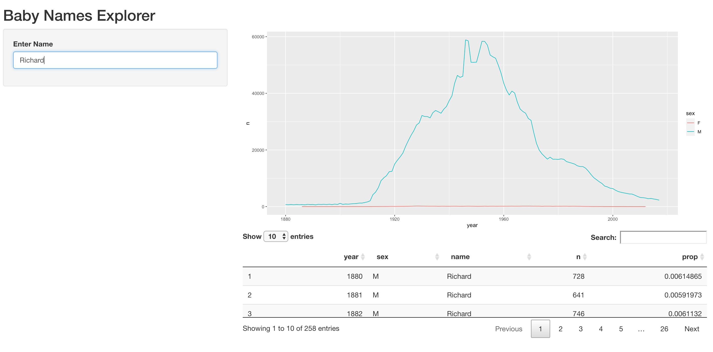

```{r}


```

### `tabsetPanel`

Another useful layout uses a combination of `tabsetPanel()` and `tabPanel()` to
arrange multiple outputs as tabs.


```{r}
ui <- fluidPage(
  titlePanel('Title'),
  sidebarLayout(
    sidebarPanel('Sidebar'),
    mainPanel(
      tabsetPanel(
        tabPanel("Tab 1", h3("Content Tab 1")),
        tabPanel("Tab 2", h3("Content Tab 2"))
      )
    )
  )
)
```

Let us use these layout functions to display the plot and table in different
tabs.

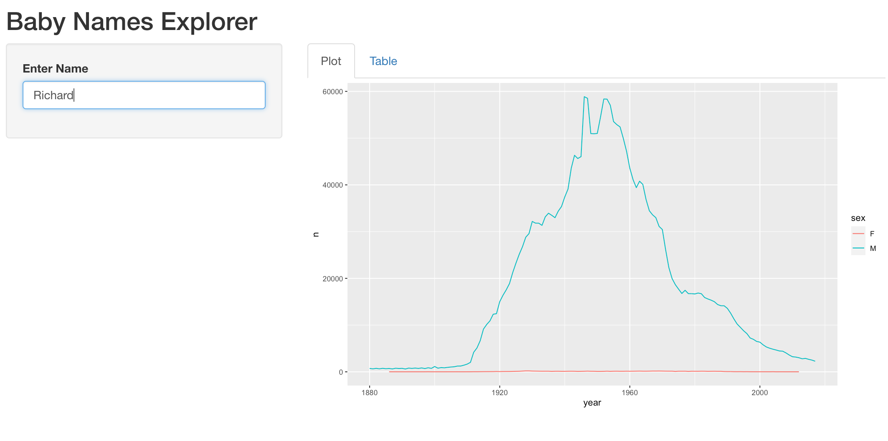

Copy the code for the app we just created and modify it to display the plot
and table in different tabs by using `tabsetPanel` and `tabPanel`.

```{r}


```
